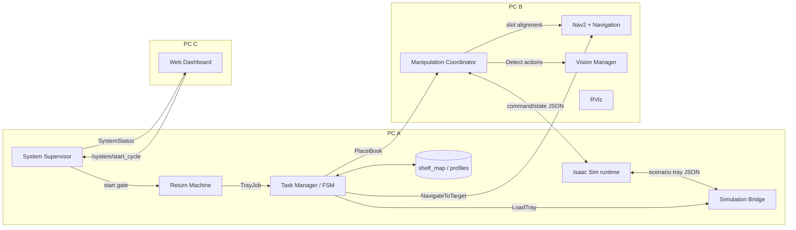

# 시스템 아키텍처와 정상 플로우

## 1. 배포 아키텍처



PC A는 시뮬레이션과 작업 순서를, PC B는 주행·인식·조작 조정을, PC C는 운영자 화면을 담당한다. 실제 팔 궤적 실행은 Isaac Sim 안의 manipulation executor가 담당한다.

## 2. 기동과 준비 판정

권장 기동 순서는 PC B → PC A → PC C다. PC A 스크립트는 Isaac Sim의 `/clock`, `/odom`을 확인한 뒤 PC B 준비를 기다린다.

`system_supervisor_node`는 다음 조건을 모두 확인해야 `SystemStatus.READY`를 발행한다.

- Isaac 시나리오가 `READY` 또는 `RUNNING`
- Task Manager heartbeat가 최신이며 FSM이 `IDLE`
- 반납기 publish service 사용 가능
- `/navigate_to_target`과 Nav2 BT navigator 활성
- `/place_book`, `/detect_grasp_point`, `/detect_target_slot` 사용 가능
- `/scan` 최신 데이터, 현재 run의 AMCL pose, `map→base_link` TF 존재

## 3. 현재 정상 시나리오

1. PC B가 Nav2, AMCL, LiDAR 변환, 비전, manipulation과 RViz를 시작한다.
2. PC A가 Isaac Sim을 시작하고 scenario runtime이 새 `run_id`로 `READY`를 발행한다.
3. Simulation Bridge가 속도를 0으로 유지하며 AMCL 초기 pose를 반복 발행한다.
4. PC A의 ROS 노드가 시작되고 supervisor가 전체 준비 상태를 `READY`로 만든다.
5. 운영자가 웹 화면 또는 `/system/start_cycle` 서비스를 호출한다.
6. Supervisor가 Return Machine에 작업 발행을 요청하고 `book_001`, `rfid_001`, `005.7`의 `TrayJob`이 발행된다.
7. Task Manager가 중복 job과 입력 길이를 검사하고 YAML에서 HOME, 반납기, `shelf_01`과 책 프로파일을 계획한다.
8. Navigation이 반납기까지 경유점 주행 후 접근 반경에서 정밀 정렬한다.
9. `LoadTray`를 통해 Isaac tray runtime이 실제 트레이를 로봇에 적재한다.
10. 첫 책을 선택하고 `shelf_01` 관측 위치로 경유점 주행·정밀 정렬한다.
11. Task Manager가 빈 `PlaceBook` goal을 보낸다. 책과 슬롯 선택은 manipulation 내부 책임이다.
12. Manipulation이 팔 스윕을 요청하고 각 관측점에서 `DetectTargetSlot`을 호출한다.
13. 전체 후보 중 슬롯을 선택하고 `/navigate_to_target`으로 AMR을 횡이동시킨다.
14. 이동 후 최신 프레임으로 `DetectGraspPoint`를 호출하고 트레이 슬롯 교정값에 snap한다.
15. Isaac executor가 계획→접근→파지→들기→사전 삽입→삽입→해제→후퇴→검증을 수행한다.
16. 성공 결과를 받은 Task Manager가 완료 책 ID를 메모리에 기록한다.
17. 모든 책이 끝나면 서가 반대 방향으로 0.65 m 목표 후퇴한 뒤 HOME으로 복귀한다.
18. FSM은 `COMPLETED`를 거쳐 `IDLE`, 시스템은 다시 `READY`가 된다.

## 4. 정상 플로우

```mermaid
flowchart TD
    A[Scenario READY + PC B ready] --> B[/system/start_cycle]
    B --> C[TrayJob 계획]
    C --> D[반납기 주행·정렬]
    D --> E[LoadTray 실제 트레이 적재]
    E --> F[서가 주행·정렬]
    F --> G[팔 스윕과 DetectTargetSlot]
    G --> H{유효 슬롯?}
    H -- 아니오 --> X[PlaceBook 실패·FSM FAILED]
    H -- 예 --> I[AMR 횡정렬]
    I --> J[DetectGraspPoint]
    J --> K{유효 책·교정 슬롯?}
    K -- 아니오 --> X
    K -- 예 --> L[계획·파지·삽입·검증]
    L --> M{placement verified?}
    M -- 아니오 --> X
    M -- 예 --> N[메모리 완료 기록]
    N --> O{남은 책?}
    O -- 예 --> G
    O -- 아니오 --> P[서가 직접 후퇴]
    P --> Q[HOME 복귀]
    Q --> R[IDLE / READY]
```

## 5. 책임 경계

| 구간 | 주 담당 | 현재 성공 조건 |
| --- | --- | --- |
| 준비 게이트 | 이현민 | simulator, Task Manager, Nav2, perception, manipulation, scan, AMCL, TF 준비 |
| 트레이 인수 | 이현민·김도윤 | `LoadTray`가 Isaac tray runtime의 완료를 반환 |
| 서가 접근 | 이동준 | position 0.05 m, yaw 0.08 rad 기준 정렬 |
| 빈 슬롯·책 인식 | 윤재민 | 최신 프레임에서 `arm_base_link` 기준 후보 반환 |
| 슬롯 맞춤·배치 | 이동준·김도윤 | AMR 횡정렬 후 실행과 배치 검증 완료 |
| 복귀 | 이동준·이현민 | 직접 후퇴 안전 한계 0.75 m 안에서 후퇴 후 HOME 도착 |

## 6. 비전과 조작 처리

```text
팔 스윕 관측점
  → RGB/depth/camera_info 동기화
  → YOLO 서가/책 후보
  → depth 연속 빈 영역 검사
  → shelf_plane_y와 픽셀 광선 교차로 3D 슬롯 생성
  → 전체 관측 후보 중 슬롯 선택
  → AMR 횡정렬
  → 새 프레임에서 트레이 책 검출
  → 트레이 슬롯 교정값으로 파지 목표 보정
  → 목표·IK·경로 검증
  → Isaac executor 실행 및 최종 배치 검증
```

## 7. 좌표계

```text
map
└── odom
    └── base_link
        ├── panda_link0
        │   └── arm_base_link
        └── wrist_camera
            └── wrist_camera_optical_frame
```

- Nav2와 YAML 목표는 `map` 기준이다.
- perception 결과는 `arm_base_link` 기준이다.
- `arm_base_link`와 optical frame은 현재 정적 0 변환 별칭이다.
- 슬롯은 검출 depth 자체가 아니라 Isaac이 제공한 서가 평면과 픽셀 광선의 교차로 계산한다.

## 8. FSM 상태

```text
INITIALIZING → IDLE → PLANNING → NAV_TO_RETURN → RECEIVE_TRAY
→ SELECT_BOOK → NAV_TO_SHELF → PLACE_BOOK → UPDATE_DATA
→ NEXT_BOOK → RETURN_HOME → COMPLETED → IDLE
```

같은 서가의 다음 책은 `SELECT_BOOK → PLACE_BOOK`으로 바로 이동한다. 세부 인식·파지 단계는 FSM 상태가 아니라 `PlaceBook` feedback phase로 표현한다.

## 9. Reset과 취소

- Timeline Stop/Play는 새 scenario `run_id`와 AMCL 초기 pose 재설정을 발생시킨다.
- Task Manager는 reset 중 활성 navigation, tray, manipulation goal을 취소하고 내부 계획을 초기화한다.
- Simulation Bridge는 잔류 속도를 없애기 위해 `/cmd_vel_nav`와 `/cmd_vel`에 0을 반복 발행한다.
- 조작 취소는 Isaac executor에 cancel 명령을 보내고 안전 정지 결과를 기다린다.
